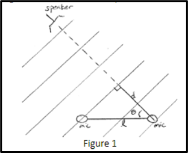
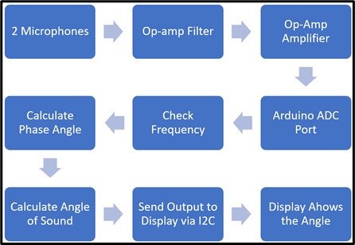

# Integrated Design Project - Arduino Direction Finder 
## Introduction

Audio Direction-finding is a relevant skill in today&#39;s world and can be used to find the direction of an incoming cell phone call. It can also be useful for maps on phones. If a device can accurately find the location of a cell tower, it would be able to more precisely figure out its own location. Another useful use case would be wifi technology. If the router can find the location of a device, it can use beamforming to send the wifi signal more reliably to a specific device and reduce interference.

In this project, I created a circuit where 2 microphones are used to identify the location of a speaker that plays a 900 Hz signal. I will calculate the location of the source as an angle to the microphones which is then displayed on the OLED screen. This is done with the Arduino Uno microcontroller. Apart from the microphones, our solution needed to incorporate both analog and software components to calculate the angle. To get to the output that I want, I plan to create a circuit to get the signal into the Arduino, and code that calculates the angle from the microphones and show it on the display.

The purpose of this project is to be able to create an audio direction finder that requires the use of both hardware and software components. This project will demonstrate our understanding of implementing filters and will test our problem-solving skills. The project will involve creating algorithms, creating equations that relate to our previous physics and math classes, and understanding filters.


<br /> Figure 1: A representation of how the mics will be able to detect the speaker and what the angle represents

##


## High-Level Block Diagram and Order of Operations

The concept of operation comes in two parts, hardware, and software. The hardware part of this assignment requires us to filter the signal and then amplify it to reach a desired voltage. The software part requires us to create code that reads the filtered and amplified signals and then calculate the phase between them to give us the angle between the source and the microphones.


<br /> Figure 2: Our block diagram of the hardware and software components of the project

To progress through the project, I planned to implement each part of the project in order that I would use them to calculate the angle, which is the same as the order of the block diagram in Figure 2.

Our first step of the project was to design the filter that would try to eliminate any frequencies out of the specified 800-1000 Hz range. Since our source should not expect any other frequencies, and since I wanted it to actively reject anything outside that range, I used an Active Band-Pass Filter for this.

To complete this section of the circuit, I first used the online filter wizard to get our desired output. The Wizard gave us the circuit components that I needed to use to get the output that I provided to it. I then built that circuit in LTspice to test if the given values were accurate to the use case I had. I then made a few adjustments to the values since the wizard did not know the specifics of the op-amp I have in our kit or the values of the linear components in our kit like the resistors.

After building the filter and testing it, I then moved on to building the amplifier. The filter I built had an amplifier already but the Arduino did not have enough resolution to be able to read voltages in the milliVolt range. This meant that another Amplifier was needed. For this, I used a simple inverting amplifier to reach our desired voltage which was about 1V.

I then connected the circuit and Arduino to each other to test how well they work with each other and if modifications to the circuit were needed to allow it to work with the code. I used the serial monitor on the arduino to check if I saw the signal being read correctly and clearly enough to perform calculations. This did not cause any issues and the serial monitor showed us what I expected.

Our next step was to connect the electret microphone to the circuit so I could test the circuit how I would actually use it instead of using the ad2 as the input. I looked for the documentation of the microphone and found that it included a diagram of how to connect it to the circuit, which I followed. The datasheet specified that its nominal operating voltage is 4.5V but it could go up to 10V. So, I used the 5V source as that was the easiest way to do that.

Our next step was to then be able to calculate the phase of the 2 signals. Since the 2 microphones were not placed next to each other, a sound signal would reach the 2 mics at different points in time. This meant that I could use that to calculate the difference in phase which would lead us to the angle. The arduino has a built-in function that reports time in the microseconds. That was exactly what I needed since the difference in phase would be in the range of 0-230 microseconds. To calculate the phase, I first needed a way to detect a point on the signal consistently for both signals. Since the amplitude of the signal would change when the location of the source changes, I went with the zero-crossing method. This was very simple to implement with our circuit design since our circuit has 0V DC bias. Every time I detected a rising edge of the signal, I recorded the time and waited for the other signal to also have a rising edge. I then compared the difference in time to calculate the phase delay.

A very similar thing was also done to implement the digital filter in our circuit compared to the calculation of the phase delay. Since I wanted to implement a digital filter to have a hard cutoff of 800-1000 Hz, being able to calculate the frequency was vital. This was done by measuring the rising edges of the same signal rather than different edges that I used to calculate the phase. A simple conversion led to the frequency. For the filter, if it was out of the range, then I stopped the calculation and waited for the next signal to come.

Once I calculated the phase delay, I were almost at the end of the project. All I needed to do was calculate the angle of the sound and then display it to the OLED screen. After some complicated mathematical calculations, I concluded that the angle could be found by simply using the inverse cosine function and inputting the speed of sound, the distance between the 2 mics, and the calculated phase delay.

Once I got our angle, the last thing was to display this to the OLED display. The display works on the I2C protocol. I did not need to implement this since a library for the display was available for the Arduino. This made it significantly easier to implement this part since I did not need to implement the protocol from scratch and just used the functions from the library after reading the documentation. This allowed us to write only a couple lines of code to get the display working.

When working on the project, I worked in that order for the hardware circuit, but since code could be implemented in any order and not make a difference, I started with the display to get the wheels rolling and let us code the more complex parts with less effort. The overall code was only approximately 60 lines from start to finish. However, this was using the flawed micros() function. A working implementation would be much longer and more complicated since I would have to use a timer I build from scratch.

## Implementation and Testing

## Filter and Amplifier

In order to filter the input, I only wanted to accept a range of 800-1000Hz. Therefore, I wanted to accept a small band of frequencies. This led us to use the Narrow Multiple Feedback Band-Pass filter. For the Amplification, I chose a gain that would allow the signal to reach 1V at a reasonable distance.

I put in 900Hz for the center frequency, 100Hz for the passband, a stopband of 20k@-4dbV. These values told the filter wizard what kind of filter I wanted, and what the bode plot should look like if I did an AC analysis. However, to also make sure it would work with our particular setup, I told the wizard to optimise the values of the components to ensure that the noise in the signal was low. This means that I picked the &#39;Low noise&#39; configuration of the filter. Other configurations would have worked, but to ensure the noise does not cause any phase changes I used this one. Phase changes would have resulted in angles that would be incorrect. Since the pass band is small, any changes of frequency resulted in large differences in phases so reducing the noise was the most important.

From the values that the wizard gave us, I had to make a couple changes to reach said 1V output. One of the resistors had to be reduced by a factor of 12x (15.8k --> 1.2k). This gave us the extra amplification I were looking for. I also changed a 99 ohm resistor into a 100ohm resistor to match our kit resistors. However, this resulted in the center of the bode plot to shift slightly. This meant that I also had to change the 31.7k resistor to a 34.8k resistor to bring the center back to 900Hz.

Once the LTspice simulation with the modified values performed how I wanted it to, I built the circuit on our breadboard and tested to see how well it worked in real life. To do this, I used the AD2 network analyser to give us the bode plot of our circuit. This would ensure that I would be able to find any differences in the simulation and the real circuit. Testing our circuit showed that our filter worked exactly as intended and with an input of 2.5mV@900Hz, our filter had an output of 30mV. Increasing or decreasing the frequency resulted in the output being lower than 30mV. This meant that our gain at the center frequency (900) was about 12 V/V.

Since there was no frequency dependent nature of the amplifier, testing this independently of the filter was not necessary. The gain of this op-amp was about 33 V/V. So, with an input of 2.5mV and a gain of ~400 (12\*33), I get our desired 1V output. I used the Network analyser on the AD2 to check this by converting the units to volts instead of the gain and using an input of 10mV (the lowest possible on the ad2).


<br /> Figure 3: Filter Wizard Bode Plot 


<br /> Figure 4: The circuit schematic that I built for the microphone. On the left is the Band-Pass filter and on the right is the amplifier


<br /> Figure 5: The circuit that was built on the breadboard. This circuit also includes the OLED display configuration with the Arduino.


<br /> Figure 6: LTspice Bode plot simulation of the full schematic


<br /> Figure 7: Bode Plot of real testing on the circuit. The center frequencies were invalid since the gain was out of range. 10mV was the minimum of the AD2

## Code

The secondary component of the project was the software. The software was needed to read the signal, measure its frequency, reject frequencies that are out of range, measure the phase difference, and use that to calculate the angle. Then incorporate the code for the display to show the angle.


<br /> Figure 7: The block diagram of the process of developing the code

### Measuring the Frequency and the Difference

In order to measure the frequency, I needed to know when the signal had a rising and falling edge. Therefore, I had to check the time when I detected it. Using the difference in the edges, I can calculate the frequency. A digital filter was also implemented to get our hard cutoff of frequencies as per the requirements.

In addition, I detected the rising edge of the 2nd signal. Measuring the time here will give us the time delay between the 2 rising edges and therefore the phase delay. With the phase calculated, I can find the direction of the signal and, therefore, find the angle of the signal.

To detect the rising and falling edges, I used the zero-crossing method. Due to the way our circuit was designed, there was no DC bias on the output and since the Arduino ADC does not read negative voltages, the negative part was read as 0V. This resulted in the graph of the voltage that was read as intermittent positive peaks with 0V gaps in between. This made it easier to implement the code since I could simply check when the voltage goes from 0 to anything greater than that (within a threshold), to detect a rising edge, and vice versa to detect a falling edge.

By measuring the time difference between these 2 events, finding the frequency is very simple as only a couple calculations are required. Since the time difference is for the delay between a single peak, that only accounts for half of the signal. To find the actual frequency, this time is doubled. This time is also in microseconds so it is converted to seconds to correctly get the frequency. This frequency value is passed onto the digital filter. A simple algorithm checks if the signal is inside the range. If not, the frequency is set to 0 so displaying the angle will output a 0.

Checking the angle of the source was very simple to calculate once I went through all the math calculations. It turns out that the source could be identified using the inverse cosine function. The speed of sound, the phase delay, and the distance between the microphones were input into the arcCos function and the angle was then calculated.

```arduino
if (oldV1 < 5 && newV1 > 5) { // Rising edge detection
    timerStart = timer;
}
if (oldV1 > 5 && newV1 < 5) { // Falling edge detection
  frequency = 1000000.0 / (micros() - timerStart);
  periodMS =  1.0 / frequency;
}
if (frequency < 800 || frequency > 1000) { // Digital Filter
  frequency = 0;
}
if (oldV2 == 0 && newV2 >= 5) { // Falling Edge Calculation
  timerStop = abs(timer - timerStart) / 500000.0; // phase delay in ms
}

Direction = acos((SOUNDSPEED * timerStop) / micDistance);
```
<br /> Figure 8: Implementation of the rising edge, falling edge, and digital filter, and the angle calculation

### Using the Display

First, I researched different websites and videos to find out how to connect and code the specific OLED display given. I found that because there already exists a library for the display in Arduino, the code was very simple to implement after installing 2 libraries to handle the Adafruit display. So, I installed the `Adafruit_GFX.h` and `Adafruit_SSD1306.h` libraries.

To get the I2C protocol to work correctly, I first had to figure out the I2C address since it is different for each display model. To find the address, I used the Arduino I2C Address locator program which I found online. This printed the address of the display onto the serial monitor of the arduino which does not rely on the I2C protocol but instead the serial port of the arduino. From there, I tested a simple program that prints the words `Find Audio Direction` onto the screen. Since the title does not need to be updated and will be static, I put this in the setup function to avoid repeated draw calls when the display did not change.

To initialize the display, I included the 2 libraries in the code, and then called the function to set up the 1306 display and provide the pin for the reset of the screen. Then, in the setup function, I set up the I2C protocol and give the address of the screen. The title screen and `Angle =` text is printed to get it ready for the loop() which then displays the calculated angle.


<br /> Figure 10 shows the circuit diagram for the display 


<br /> Figure 12 shows how the display was incorporated into the code 

## Validation of the Integrated Project

To test our code, I used the AD2 to send a signal directly to the Arduino to eliminate the variable of the circuit. I sent a 900 Hz signal on the 2 different mics and varied the phase to see if the serial monitor would be able to detect the differences. The result is shown in Figure 11. It is very evident that the phase of the recorded signal is matching what I are inputting from the AD2.


<br /> Figure 11 shows the phase between the two signals at different phase angles.


<br /> Figure 12: What the display shows when the program is running.

Unfortunately, I wasn't able to get the code to work to display the angle. This was because the micros() function in the arduino was giving us problems because apparently it was not accurate/precise enough to measure such small differences in time. As a result, I don't have video or photo proof that the code works to show the angle. However, the diagram shows that our hardware was working as intended and the code does read the frequency. The display also works as intended. The Arduino was able to display the correct output from the microphones on the serial plotter. The problem that occurred revolved around the detection of the phase angle from the signal since the method I used to measure time was inaccurate.

To test the rest of the code without having to use the micros() function, I decided to hardcode the signal into the code to see if the rest of the code works as expected. For example, to test the digital band pass, I hardcoded the timerStart value and the _(micros() - timerStart)_ section of code with static numbers to see if the code will still work as expected. And it did. The reported frequency was correct. Hardcoding the other signal also gave us the correct phase calculation.

## Conclusion

Even though I were not able to fully complete the project, I were able to apply our understanding and develop a circuit that matches the specifications accurately. This project tested our knowledge of filters and amplifiers as well as our coding skills. Coming from classes like circuits and devices, this class asked us to design a filter and amplifier and apply what was taught to us in that class. Our coding skills were put to the test so that I could develop code that reads data from the circuit I developed. The audio direction project reminiscent of our majors consisted of both hardware and software. In order to accomplish this project, it required knowledge of both ends of software and hardware. Creating the block diagram at the beginning of the class allowed us to map our process out for the semester. In addition, creating the milestone reports was a good way for us to mark our progress on the project. The milestone reports acted as a summary of the week and allowed us to see our overall progress through the project. As I complete future projects, this project was a reminder of how the concepts and problems I encounter in class can be implemented.

To reiterate, every section of the project worked except our timer. Our filter, amplifier, and all of the code works if the micros() function is ignored. So, if I had more time to finish this project, our project would be complete since implementing the hardware timer should not take too long since I already know exactly what I need to do.

If I had to do this project again, having more time would certainly have helped significantly. Since this was a summer class, I did not have that much time, so when I finally diagnosed that the micros() function was incapable for our project, it was basically over. So, during a regular semester if I had to do this again, I would be able to implement our own hardware timer so the code would work properly.
